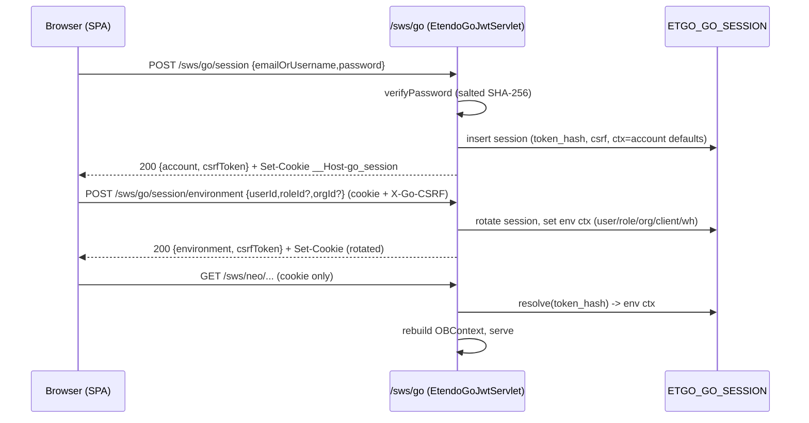
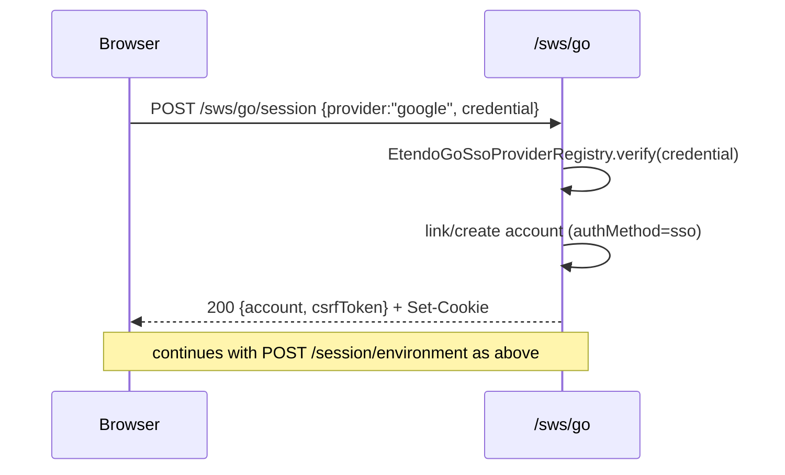
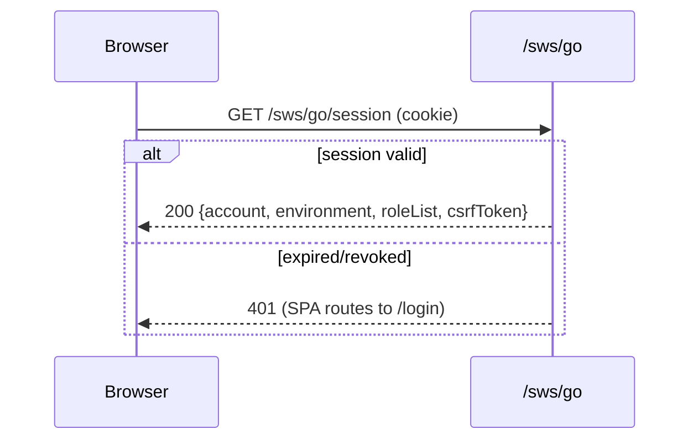
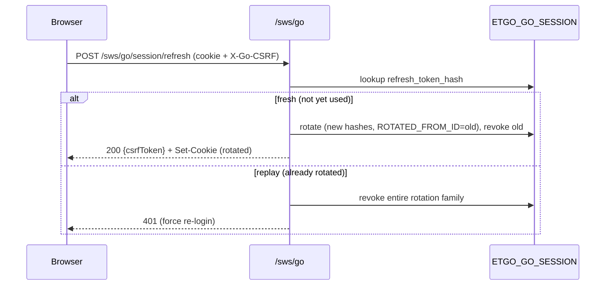

# ADR-0001 — Backend-managed opaque cookie session for Etendo Go

- **Status:** Accepted
- **Date:** 2026-07-23
- **Deciders:** Etendo Go backend (ETP-4575 assignee)
- **Jira:** ETP-4575 (Auth 1/2, backend) · ETP-4576 (Auth 2/2, frontend) · Epic ETP-3504
- **Source:** [PRD — Client & Delivery Security Hardening](https://etendoproject.atlassian.net/wiki/spaces/PYPI/pages/5106892804/), WS-1 / SEC-10
- **Supersedes:** the two browser-persisted Bearer tokens (`sf_platform_token`, `sf_auth_token`)

> This ADR covers the auth-protocol slice that formally gates ETP-4575 (the portion of the
> ETP-4569 assessment that touches auth). The remaining ETP-4569 workstreams (CSP, attachment
> IDOR, CSV injection, telemetry) are out of scope here.

---

## Context

Today the Etendo Go SPA holds **two Bearer credentials in `localStorage`**, both readable by any
JavaScript on the origin:

1. **Platform token** — an opaque 32-hex string stored on `ETGO_ACCOUNT.SESSION_TOKEN`
   (`EtendoGoJwtServlet.java:1809`), returned in the JSON body of `/sws/go/login`,
   `/sws/go/register`, `/sws/go/sso/{provider}`. No expiry, no rotation, no revocation, one row
   per account. Validated by `EtendoGoJwtDalHelper.findActiveAccountByToken()`. Frontend key:
   `sf_platform_token`.
2. **Environment token** — a stateless SWS **JWT** (`SecureWebServicesUtils.generateToken`,
   claims `user/client/role/organization/warehouse`, HS256), issued by `GET /sws/go/login?userId=`
   and consumed by `/sws/neo/*` via `NeoAuthenticator`/`JwtAuthUtils`. Frontend key: `sf_auth_token`.

This is finding **SEC-10 (critical)**: combined with the absence of a CSP, a single XSS yields full
session theft. There is no logout/refresh/rotation contract server-side; `isTokenExpired()` on the
client is a stub; logout is client-only state clearing.

**Existing precedent in the same module.** The OAuth2 subsystem already implements a stateful,
revocable, expiring opaque credential validated by a servlet filter:
`ETGO_OAUTH2_TOKEN` (`ACCESS_TOKEN_HASH` unique, `REFRESH_TOKEN_HASH` unique, `EXPIRES_AT`,
`IS_REVOKED`), `OAuth2Utils.hashToken()`, rotation/revoke SQL in `OAuth2Servlet`, and
`OAuth2Filter` (`/sws/mcp`) which hashes the bearer, looks it up over the Hibernate JDBC
connection and rebuilds request context. This ADR models the new session on that precedent.

---

## Decision

Adopt **PRD Option A: a backend-managed opaque session**, delivered as a `__Host-` cookie,
same-origin over the existing CloudFront `/etendo/*` route. The cookie is the **only** credential
the browser ever holds; neither the platform token nor the environment JWT is returned to
JavaScript again.

### D1 — The cookie authenticates both `/sws/go/*` and `/sws/neo/*`

The session cookie is the single credential for **all** authenticated app traffic. A new servlet
filter validates the cookie and rebuilds `OBContext` from the server-side session record (which
stores the selected environment: `user/role/client/org/warehouse`).

The environment **JWT stops being exposed to the browser**. Internally we keep reusing
`SecureWebServicesUtils.createContext(...)` to map the stored environment onto `OBContext`, so the
context-derivation logic that `/sws/neo/*` depends on is unchanged — only its *source* changes from
"JWT in `Authorization` header" to "environment columns on the session row keyed by the cookie".

`/sws/neo/session` (business defaults) is **not** touched and is **not** reused for authentication.

> Rejected alternative (D1-min): keep the JWT alive but store it server-side on the session row and
> have `/sws/neo` receive it internally. Rejected because it keeps two credential formats and two
> validators alive indefinitely; storing plain context columns is simpler and lets us delete the
> browser-facing JWT path after migration.

### D2 — Session store: new table `ETGO_GO_SESSION`

A dedicated table (not an extension of `ETGO_ACCOUNT.SESSION_TOKEN`, which is 1:1 and has no
lifecycle semantics), modeled on `ETGO_OAUTH2_TOKEN`:

| Column | Type | Purpose |
|---|---|---|
| `ETGO_GO_SESSION_ID` | ID | PK |
| `ETGO_ACCOUNT_ID` | FK | owning platform account |
| `SESSION_TOKEN_HASH` | VARCHAR, unique | SHA-256 of the cookie value; **plaintext is never stored** |
| `CSRF_TOKEN` | VARCHAR | session-bound CSRF secret |
| `REFRESH_TOKEN_HASH` | VARCHAR, unique | one-time refresh identifier |
| `AD_USER_ID`, `AD_ROLE_ID` | FK | selected environment user/role |
| `CTX_CLIENT_ID`, `CTX_ORG_ID`, `M_WAREHOUSE_ID` | FK | selected environment client/org/warehouse — named `CTX_*` to avoid clashing with the mandatory audit `AD_CLIENT_ID`/`AD_ORG_ID` columns |
| `AUTH_METHOD` | VARCHAR | `password` \| `sso` |
| `EXPIRES_AT` | timestamp | idle timeout |
| `ABSOLUTE_EXPIRES_AT` | timestamp | hard cap regardless of activity |
| `IS_REVOKED` | char `Y/N` | logout / server-side invalidation |
| `ROTATED_FROM_ID` | FK self | rotation lineage → refresh-replay detection |
| `USER_AGENT`, `IP_HASH` | VARCHAR | optional binding / audit |
| audit (`CREATED`, `UPDATEDBY`, …) | | standard Etendo audit columns |

The DAL entity is **code-generated into `src-gen/`** — schema changes flow through table XML +
`AD_TABLE`/`AD_COLUMN` sourcedata + `migrationscripts/`, then a model regen. Do not hand-edit the
generated entity.

### D3 — Cookie contract

```
Set-Cookie: __Host-go_session=<opaque>; Secure; HttpOnly; Path=/; SameSite=Lax
```

- `__Host-` prefix ⇒ no `Domain`, `Path=/`, `Secure` mandatory (host-locked).
- `HttpOnly` ⇒ not readable from JS (this is what closes SEC-10).
- No `Max-Age`/`Expires` ⇒ session cookie; lifetime is enforced server-side via `EXPIRES_AT`.
- `SameSite=Lax` preserves password/Google top-level onboarding navigation while blocking most
  cross-site sends — **defense in depth, not the sole CSRF control** (see D4).

### D4 — CSRF defense

- A session-bound `CSRF_TOKEN` is returned in a **non-sensitive** response field (body) and must be
  echoed in a custom header (`X-Go-CSRF`) on **every unsafe method** (`POST`/`PUT`/`PATCH`/`DELETE`).
- Strict **`Origin`** validation against a fail-closed allowlist, with **`Referer`** fallback.
- Never accept the same credential through both cookie and query parameter.
- Precedent for the double-submit shape: `EtendoGoGoogleIdentityVerifier.validateCsrfTokenIfPresent`
  (`g_csrf_token`, constant-time compare).

### D5 — HTTP contract `/sws/go/session*`

| Method + path | Replaces | Request | Response to JS | Effect |
|---|---|---|---|---|
| `POST /sws/go/session` | `/login` | `{email,password}` | `{account, csrfToken}` + `Set-Cookie` ×2 | create session (password); **no token in body** |
| `POST /sws/go/session/register` | `/register` | `{email,password,name,language?}` | `{account, csrfToken}` + `Set-Cookie` ×2 | register + create session; **no token in body** |
| `POST /sws/go/session/sso/{provider}` | `/sso/{provider}` | provider raw body (e.g. `{credential}`) | `{account, csrfToken}` + `Set-Cookie` ×2 | create session (SSO); **no token in body** |
| `GET /sws/go/session` | client-side restore from `sf_auth_*` | — (cookie) | `{account, environment, roleList, csrfToken}` | restore context after reload |
| `POST /sws/go/session/environment` | `GET /login?userId=` | `{userId,roleId?,orgId?}` | `{environment, roleList, csrfToken}` + rotated cookies | validate context, select environment/role/org + **rotate** session |
| `POST /sws/go/session/refresh` | — (did not exist) | — (refresh cookie, Origin-checked) | `{csrfToken}` + new cookies | rotate one-time identifier |
| `DELETE /sws/go/session` | client-only logout | — (cookie + CSRF) | `204` + expired cookies | **server-side invalidation** |

> **Cookies:** two host-locked cookies are issued together — `__Host-go_session` (session) and `__Host-go_refresh`
> (one-time refresh), both `Secure; HttpOnly; Path=/; SameSite=Lax`. `refresh` is protected by
> same-origin (SameSite + Origin) rather than a CSRF token, since the session may be expired when it runs.
> SSO create is a dedicated sub-route (`/session/sso/{provider}`) rather than a body-shape branch on
> `POST /session`, to avoid a double read of the raw request body needed by provider verification.

- `onboarding`, `change-password`, `password-reset` keep their behavior but authenticate via the
  session cookie instead of the platform Bearer.
- All session responses set `Cache-Control: no-store` (precedent `OAuth2Servlet.java:1549`) and
  `X-Content-Type-Options: nosniff`.

### D6 — Rotation, refresh & replay

- Rotate the session identifier after **authentication** and after **environment/privilege change**.
- Refresh is **one-time**: a used `REFRESH_TOKEN_HASH` that is presented again ⇒ treat as replay ⇒
  revoke the whole rotation family (follow `ROTATED_FROM_ID` lineage) and force re-login.
- Expiry is enforced on both `EXPIRES_AT` (idle) and `ABSOLUTE_EXPIRES_AT` (hard cap).

### D7 — Legacy Bearer during rollout (measured, reversible)

Behind a **feature flag**, the backend keeps accepting both legacy browser Bearer paths (platform
account token and environment JWT) and **counts** how many requests still use them, so we can
measure the window and turn it off after the forced re-login. Flag OFF ⇒ legacy Bearer ⇒ `401`.
OAuth2/MCP access tokens issued to external clients are separate credentials and remain supported.

---

## Sequence diagrams

### Password login → first environment



### Google SSO



### Restore after reload



### Refresh (one-time rotation + replay detection)



### Logout

```mermaid
sequenceDiagram
    participant B as Browser
    participant GO as /sws/go
    participant DB as ETGO_GO_SESSION
    B->>GO: DELETE /sws/go/session (cookie + X-Go-CSRF)
    GO->>DB: set IS_REVOKED='Y'
    GO-->>B: 204 + Set-Cookie __Host-go_session=; Max-Age=0
    B->>GO: any later request with old cookie
    GO-->>B: 401
```

---

## Consequences

**Positive**
- Session/refresh credentials are unreachable from JavaScript ⇒ closes SEC-10.
- Server-side revocation ⇒ real logout, real expiry, rotation, replay defense.
- Reuses proven in-module primitives (`OAuth2Utils.hashToken`, filter pattern, `no-store`).
- Single credential across `/sws/go` + `/sws/neo` ⇒ two token systems collapse into one.

**Negative / costs**
- New table + `src-gen` regen + migration scripts (not a Java-only change).
- New `@WebFilter` and CSRF/Origin enforcement (new threat surface to test).
- Migration is a **forced re-login** for all users; needs a release note and documented rollback
  (invalidate the new session format).
- Multi-tab logout propagation is not automatic (frontend concern for ETP-4576 via
  `storage`/`BroadcastChannel`).

**Neutral**
- `EtendoGoJwtServlet` is large (~1940 lines, `@SuppressWarnings("java:S1448")`); we minimize edits
  there by putting validation in a new filter + a new `GoSessionService`.

---

## Testing (TDD, red-first)

Module idiom: JUnit 4 + Mockito, `mockStatic(OBContext.class)`, mocked `HttpServletRequest/Response`,
`ResponseCapture` + `ArgumentCaptor` for headers/`Set-Cookie`. Red tests to author first:

- Cookie attributes present (`__Host-`, `Secure`, `HttpOnly`, `Path=/`, `SameSite=Lax`, no `Domain`, no `Max-Age`).
- No session/refresh token in any `/sws/go/session*` response body.
- CSRF cross-site: unsafe method without `X-Go-CSRF` / disallowed `Origin` ⇒ `403`.
- Refresh replay ⇒ family revoked, second use `401`.
- Rotation after login and after environment switch (old hash invalid).
- Logout ⇒ `IS_REVOKED='Y'` + expired cookie; later request `401`.
- Idle and absolute expiry ⇒ `401`.
- Legacy Bearer flag ON authenticates + increments counter; OFF ⇒ `401`; reject cookie+query together.
- Regression: password login, Google SSO, onboarding (NDJSON), environment switch, change-password.

---

## Frozen contract for ETP-4576

The table in **D5** plus the cookie name `__Host-go_session` and the CSRF header `X-Go-CSRF` are the
**frozen agreement** between `feature/ETP-4575` (backend) and `feature/ETP-4576` (frontend). The
frontend removes all `Authorization: Bearer` construction, stops persisting tokens, sends
`X-Go-CSRF` on unsafe methods, and purges the legacy keys: `sf_auth_token`, `sf_auth_user`,
`sf_auth_client_id`, `sf_auth_client_name` *(currently orphaned by `logout()`)*, `sf_auth_rolelist`,
`sf_auth_selected_role`, `sf_auth_selected_org`, `sf_platform_token`, `sf_platform_auth_method`,
`sf_onboarding_initial_view`, `sf_onboarding_notice`.
