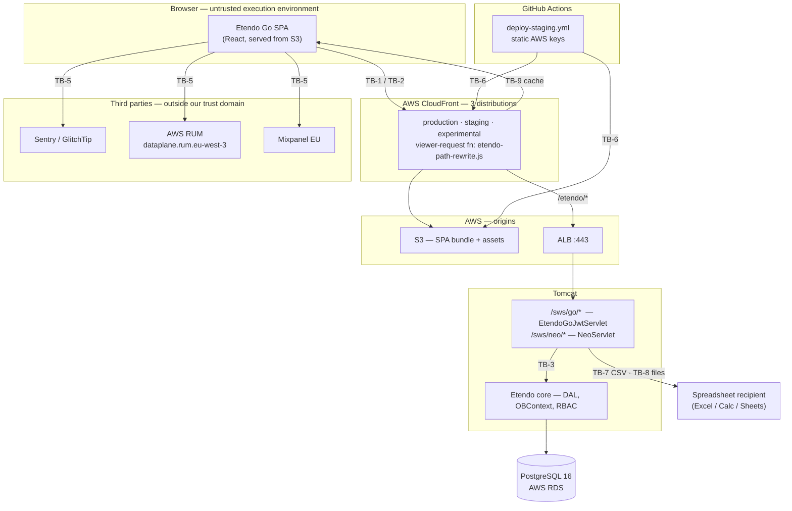

# Threat model — Etendo Go client & delivery (STRIDE)

- **Status:** Draft for review
- **Date:** 2026-07-30
- **Author:** Etendo Go (ETP-4569 assessment)
- **Jira:** ETP-4569 (this document, deliverable E3) · Epic ETP-3504
- **Source:** [PRD — Client & Delivery Security Hardening](https://etendoproject.atlassian.net/wiki/spaces/PYPI/pages/5106892804/) §2 — "Security invariants and threat model"
- **Scope:** the nine findings SEC-04 and SEC-08…14. Input-validation findings SEC-01…03 and SEC-05…07 are a separate initiative and are out of scope.

> **What this document is for.** The PRD requires P0 to "record the trust boundaries and abuse cases
> using STRIDE". This document is also the **index that ties the four ETP-3504 ADRs together** — they
> live in two repositories and, read individually, none of them states what an implementer is
> defending against. Read this first, then the ADR for the workstream you are about to touch.

### ADR map

| ADR | Repo | Covers |
|---|---|---|
| ADR-0001 (`feature/ETP-4575`, PR #777) | `com.etendoerp.go` | Backend-managed opaque cookie session (SEC-10) |
| [ADR-0002](../adr/0002-edge-security-headers.md) | `com.etendoerp.go` (implementation owned by `schema_forge`) | CSP + hardening headers at the edge (SEC-08, SEC-09, SEC-13) |
| [ADR-0003](../adr/0003-attachment-authorization.md) | `com.etendoerp.go` | Centralized attachment authorization (SEC-11b, SEC-12) |
| [ADR-0004](../adr/0004-csv-formula-neutralization.md) | `com.etendoerp.go` | Spreadsheet formula neutralization (SEC-04) |

No ADR covers **SEC-09b** (`Cache-Control` on NEO JSON) or **SEC-14** (telemetry egress). Both are
analyzed here; SEC-14 in particular has no design artifact yet, which is why §6 goes deeper on it.

---

## 1. System decomposition

### Trust boundaries

| ID | Boundary | Crossing |
|---|---|---|
| **TB-1** | Browser JS ↔ session credential | Any script on the origin vs. the credential store |
| **TB-2** | Foreign origin ↔ our origin | Cross-site request carrying ambient authority |
| **TB-3** | Authenticated identity ↔ authorized object | Role / client / organization / record access |
| **TB-4** | CloudFront edge ↔ origins | Response-header and routing control plane |
| **TB-5** | Application ↔ third-party telemetry | Data egress to parties we do not control |
| **TB-6** | CI/CD ↔ AWS infrastructure | Deploy credentials with write access to what users load |
| **TB-7** | Exported file ↔ recipient's spreadsheet | Data leaves our trust domain and becomes code |
| **TB-8** | Uploaded file ↔ storage and serving | Attacker-supplied bytes and metadata served back |
| **TB-9** | Private response ↔ shared/browser cache | Authenticated JSON at rest in a cache |

### Security invariants (PRD §2)

1. A browser script cannot read or replay a session credential.
2. A state-changing request cannot succeed cross-site without the CSRF proof.
3. An attachment operation cannot cross the authorized business-record boundary.
4. An exported cell cannot be interpreted as a spreadsheet formula.
5. Active content cannot execute from the attachment origin.
6. Telemetry cannot carry credentials, sensitive user data, or unapproved identifiers.
7. Private JSON cannot be stored by shared or browser caches.

---

## 2. Actors

| Actor | Capability assumed | Boundary |
|---|---|---|
| A1 Browser / XSS | Executes arbitrary JS on our origin | TB-1 |
| A2 Cross-site attacker | Controls a page the victim visits; cannot read our responses | TB-2 |
| A3 Low-privilege same-org user | Valid credentials, same organization, lacks object access | TB-3 |
| A4 Cross-org / cross-client user | Valid credentials in a different org or client | TB-3 |
| A5 Attachment uploader | Can upload a file and control its bytes, name and declared MIME | TB-8 |
| A6 Spreadsheet recipient | Opens an exported CSV; is the *victim*, not the attacker | TB-7 |
| A7 Third-party telemetry provider | Receives whatever we send; may be breached or subpoenaed | TB-5 |
| A8 CDN / cache | Stores and replays responses; may serve them to the wrong principal | TB-9, TB-4 |
| A9 Compromised provider credentials | Holds our AWS deploy keys or a provider token | TB-6, TB-5 |

---

## 3. STRIDE — credential and session boundaries (TB-1, TB-2)

**Status: open in the current deployment; remediation is in progress in ETP-4575/4576.** Static inspection of the 2026-07-30 staging bundle still found the legacy token keys and Bearer-header construction sites. ADR-0001 defines the accepted target; it is not deployment evidence.

| STRIDE | Abuse case | Actor | Invariant | Status |
|---|---|---|---|---|
| **S**poofing | Steal `sf_auth_token` / `sf_platform_token` from `localStorage` via XSS and replay them as a full session | A1 | 1 | 🟡 Target, not yet deployed — `__Host-` `HttpOnly` cookie; credential unreachable from JS |
| **S**poofing | Reuse a token indefinitely: the platform token had no expiry, no rotation, no revocation | A1 | 1 | 🟡 Target, not yet deployed — server-side `EXPIRES_AT` / `ABSOLUTE_EXPIRES_AT` / `IS_REVOKED` |
| **T**ampering | Forge a state-changing request from a foreign origin using the ambient cookie | A2 | 2 | 🟡 Target, not yet deployed — session-bound CSRF token in `X-Go-CSRF` on unsafe methods + fail-closed `Origin` allowlist with `Referer` fallback |
| **R**epudiation | Logout was client-side state clearing only; a stolen token stayed valid after "logging out" | A1 | 1 | 🟡 Target, not yet deployed — `DELETE /sws/go/session` revokes server-side |
| **E**oP | Replay a refresh identifier to resurrect a revoked session | A1, A2 | 1 | 🟡 Target, not yet deployed — one-time refresh; replay revokes the whole rotation family via `ROTATED_FROM_ID` |
| **E**oP | Escalate by switching to a role or organization the account does not own | A3, A4 | 3 | 🟡 Target, not yet deployed — ownership validated in `POST /session/environment`, session rotated on privilege change |
| **I**nfo | Session credential leaks into URLs, telemetry or logs | A1, A7 | 1, 6 | 🔴 Bearer credentials remain browser-readable; telemetry sanitization is also open (§6) |

**Residual:** the legacy Bearer path remains accepted behind the measured flag
`etgo.legacy.bearer.enabled` (ADR-0001 §D7). While ON, A1 can still replay a stolen legacy token.
**Turning the flag off is what actually closes invariant 1** — shipping the cookie is necessary but
not sufficient.

---

## 4. STRIDE — authorization boundary (TB-3)

**Status: open. Design in ADR-0003; implementation is ETP-4570.**

| STRIDE | Abuse case | Actor | Invariant | Status |
|---|---|---|---|---|
| **I**nfo | Enumerate attachment IDs and download any attachment in the installation. `NeoServlet.service()` wraps dispatch in `setAdminMode()` (`:139`, `:168`), bypassing the readable-org filter; `handleDownload` does a bare `OBDal.get(Attachment.class, id)` (`NeoAttachmentsHelper.java:223`) with no scoping | A3, A4 | 3 | 🔴 **Open** — confirmed IDOR |
| **I**nfo | List attachments outside the caller's readable organizations — `setFilterOnReadableOrganization(false)` (`:124`, `:427`) | A3, A4 | 3 | 🔴 Open |
| **T**ampering | Delete or re-describe another tenant's attachment via the bare-ID route (`handleDelete` `:321`, `handleUpdateDescription` `:353`) | A3, A4 | 3 | 🔴 Open |
| **T**ampering | Attach a file to a record the caller cannot write (`handleUpload`, no record authorization) | A3, A4 | 3 | 🔴 Open |
| **I**nfo | Distinguish "does not exist" from "not authorized" and use it as an existence oracle | A3, A4 | 3 | 🔴 Open — ADR-0003 §D5 mandates a uniform `404` |
| **E**oP | Pass a forged `tableName`/`recordId` so the server authorizes a record other than the attachment's real parent | A3, A4 | 3 | 🔴 Open — ADR-0003 §D2: client context is never the proof; mismatch is rejection |

**Key insight for the implementer.** Organization equality is **not** sufficient authorization — a
same-org user (A3) may legitimately lack access to the object. Both platform checks are required:
`EntityAccessChecker.checkReadableAccess()` for role/table access and
`SecurityChecker.checkReadableAccess()` for client/org at record level. See ADR-0003 §D3.

**Root cause beyond attachments.** The blanket admin mode in `NeoServlet.service()` disables DAL's
own authorization for *every* built-in dispatch, not just attachments. ADR-0003 deliberately scopes
the fix to attachments and recommends a follow-up ticket. **This is the highest-value open question
in the epic**: the same pattern could hide equivalent gaps in other built-in endpoints that were
never audited.

---

## 5. STRIDE — delivery, cache and export boundaries (TB-4, TB-7, TB-8, TB-9)

| STRIDE | Abuse case | Actor | Invariant | Status | Ref |
|---|---|---|---|---|---|
| **T**ampering | Inject a script via any XSS sink and have it execute — no CSP on any sampled environment | A1 | 1 (defense in depth) | 🔴 Open | ADR-0002 |
| **T**ampering | Frame the SPA for clickjacking-driven state change — production/staging use `SAMEORIGIN`; experimental has no XFO; `frame-ancestors` is absent everywhere | A2 | 2 | 🟡 Partial | ADR-0002 §D4 |
| **S**poofing | Downgrade to HTTP and strip `Secure`, breaking cookie confidentiality — HSTS is absent or inconsistent | A2, A8 | 1 | 🟡 Live on production/staging; absent on experimental; inventory pending | ADR-0002 §D5 |
| **I**nfo | Leak full URLs with identifiers to third parties via `Referer` — Referrer-Policy is absent or inconsistent | A7 | 6 | 🟡 Live on production/staging; absent on experimental/API sample | ADR-0002 §D4 |
| **T**ampering | Exported cell executes as a formula in the recipient's spreadsheet: exfiltration, phishing, legacy DDE | A6 (victim) | 4 | 🟡 Classic triggers covered in backend/core; fiscal monitor and full-width/standalone-control cases remain open | ADR-0004 |
| **T**ampering | Serve active content from the attachment origin — no `nosniff`; `resolveContentType(attachment.getDataType())` (`:234`) echoes the attacker-controlled stored MIME | A5 | 5 | 🟡 Partial — `Content-Disposition` is set (`:235`); `nosniff` absent | ADR-0003 §D7 |
| **T**ampering | Upload SVG/HTML with a spoofed MIME or double extension and get it served inline | A5 | 5 | 🔴 Open — `handleUpload` only checks the outer `multipart/` type (`:161-163`) | ADR-0003 §D7 |
| **I**nfo | Authenticated NEO JSON (`/sws/neo/session` returns org + financial data) stored by a shared or browser cache and served to another principal | A8 | 7 | 🔴 Open — `NeoServlet.writeResponse()` (`:248-266`) sets no default `Cache-Control`. **No ADR covers this** | SEC-09b / ETP-4571 |
| **T**ampering | Mixed-content downgrade of a subresource | A2 | — | 🟡 No active violation reproduced; deployed bundle contains localhost HTTP literals and no CI/CSP guard | ADR-0002 §D8 |

---

## 6. STRIDE — telemetry egress and provider credentials (TB-5, TB-6)

**This section is the part of the threat model no ADR covers.** SEC-14 has no design artifact, and
the credential boundary (TB-6) was never modeled at all. The analysis below is new as of 2026-07-29.

### 6.1 Telemetry egress (A7, invariant 6)

Three providers receive data from the browser: Sentry/GlitchTip, AWS RUM
(`https://dataplane.rum.eu-west-3.amazonaws.com`, `lib/rum.js:71`) and Mixpanel EU (opt-in).

| STRIDE | Abuse case | Status |
|---|---|---|
| **I**nfo | Session credential, email, record values, organization or customer names reach a provider through **custom context, breadcrumbs, exception messages, URLs or headers** — paths the KPI property allow-list (`lib/observability/propertyPolicy.js`) does not cover | 🔴 Open |
| **I**nfo | PII enabled in production by build configuration — `resolveSentrySendDefaultPii(env.VITE_SENTRY_SEND_DEFAULT_PII)` (`lib/sentry.js:67-68`). Default is `false`, but the flag **is** overridable at build time | 🔴 Open — see TM-02 |
| **I**nfo | A breached or legally compelled provider exposes everything historically sent | 🔴 Open — mitigated only by sending less |
| **D**oS | Provider rate limiting or failure degrades or blocks product behavior | 🟡 Needs the kill switch and bounded retries required by PRD WS-3 |

The core package `schema_forge_core/packages/app-shell-core/src/observability/` is still a **no-op**
(`index.js`, `ObservabilityContext.jsx`) — the gateway that would enforce this does not exist yet.
**The control is the gateway, not the file relocation.**

### 6.2 Provider and deploy credentials (A9, TB-6)

`schema_forge/.github/workflows/deploy-staging.yml` holds four credentials:

| Credential | Line | Exposure |
|---|---|---|
| `AWS_ACCESS_KEY_ID` + `AWS_SECRET_ACCESS_KEY` | `:110-111` | **Static long-lived keys** via `aws-actions/configure-aws-credentials@v4`. No `role-to-assume`, no OIDC, no `id-token: write` |
| `SENTRY_AUTH_TOKEN` | `:95` | Build-time only (sourcemaps); not shipped to the browser |
| `VITE_MIXPANEL_TOKEN` | `:98` | `VITE_`-prefixed ⇒ **inlined into the browser bundle** |

| STRIDE | Abuse case | Status |
|---|---|---|
| **E**oP | Compromise of the GitHub secrets yields **long-lived** write access to S3 and to CloudFront distribution configuration | 🔴 Open — TM-01 |
| **T**ampering | With that access, replace the SPA bundle, or **detach the `etendo-go-security-headers-v1` policy** and remove the CSP that ADR-0002 is about to add | 🔴 Open — TM-01 |
| **T**ampering | Inject arbitrary events into the Mixpanel project using the token extracted from the public bundle (data poisoning, quota exhaustion) | 🟡 Low — TM-03 |
| **R**epudiation | Static keys are shared and non-expiring ⇒ actions are hard to attribute to a principal or a run | 🔴 Open — TM-01 |

**Why TM-01 matters more after ADR-0002.** Today those keys can deface the SPA. Once the CSP lands,
the same keys become the **control plane for the security header policy itself** — an attacker who
holds them can silently remove the CSP and then exploit any XSS. The deploy credential therefore
becomes part of the XSS defense, and its weakness partly undermines what ADR-0002 buys. This
strengthens the existing "AWS static credentials → OIDC" item from known tech debt into a dependency
of the epic's own security posture.

---

## 7. New findings surfaced by this threat model

Recorded here because they are **not** in the PRD's findings table.

| ID | Finding | Severity | Owner |
|---|---|---|---|
| **TM-01** | Deploy workflow uses static long-lived AWS keys (`deploy-staging.yml:110-111`), no OIDC. Grants durable write access to the SPA bundle and to CloudFront config — including the CSP policy ADR-0002 introduces | **Medium-high** | Unassigned |
| **TM-02** | `VITE_SENTRY_SEND_DEFAULT_PII` allows enabling PII egress via build-time configuration (`lib/sentry.js:67-68`). PRD WS-3 requires production to be unable to do this | Medium | Unassigned (WS-3) |
| **TM-03** | `VITE_MIXPANEL_TOKEN` is inlined into the public browser bundle (`deploy-staging.yml:98`). Expected for Mixpanel project tokens, but permits event injection and quota exhaustion | Low | Unassigned (WS-3) |
| **TM-04** | The client/server parity comment covers only the narrower classic trigger set and can be misread as proof that the full PRD contract is closed | **Process risk** | ETP-4568 |
| **TM-05** | `NeoServlet.service()`'s blanket `setAdminMode()` (`:139`, `:168`) disables DAL authorization for *all* built-in dispatch. SEC-11b is one symptom; other built-in endpoints were never audited under this lens | **High (unquantified)** | Needs a follow-up ticket |

**TM-04 and TM-05 are the two most valuable outputs of this exercise.** TM-04 is ambiguous implementation-parity documentation that could get the remaining critical scope closed without a full fix. TM-05 suggests the audit that produced
SEC-11b may have found one instance of a class rather than a single bug.

---

## 8. Residual risks and owners

| Risk | Owner today | Note |
|---|---|---|
| Legacy Bearer flag still ON ⇒ invariant 1 not yet actually closed | Román (ETP-4575/4576) | Closure requires turning the flag off after the forced re-login window |
| SEC-04, SEC-08, SEC-09, SEC-09b, SEC-11b, SEC-12, SEC-13, SEC-14 not closed | **Nobody** | Their implementation tasks remain `Unassigned` / `TBD`; SEC-04/09/13 have partial controls |
| TM-01 … TM-05 | **Nobody** | New; not yet in the epic backlog |
| SEC-10 staging evidence contains legacy keys and Bearer construction | Román | ETP-4575/4576 are in progress; authenticated cookie/rotation capture remains pending |
| Source findings document `contacts-test-report.md` absent from the workspace | Sebastian Barrozo (reporter) | Accepted 2026-07-29: PRD is the source of record instead |
| Low-privilege black-box matrix not executed | Unassigned | Requires provisioned staging; ADR-0003 recommends `OBBaseTest` first |

> **The dominant risk in this epic is not technical.** Seven of nine findings — including one critical
> and two high — have **no owner**. The four ADRs make the work startable by someone else; they do not
> make it happen.

---

## 9. Deliberately out of scope

- SEC-01…03, SEC-05…07 (per-field input validation) — separate forms-validation initiative.
- Pentest-grade assurance. This re-verifies known findings and specifies fixes; the full re-test is
  **ETP-4579**.
- Server-side Etendo core authentication (`AD_Session`, Tomcat `JSESSIONID`) except where the Go
  session interacts with it.
- Network, host and database hardening below the application layer.

---

## Appendix — production and non-production hosts

Partial input for the subdomain inventory (ETP-4569 deliverable E4a), which gates HSTS
`includeSubDomains` per ADR-0002 §D5.

| Environment | Host | CloudFront distribution |
|---|---|---|
| Production | `go.etendo.cloud` (`lib/sentry.js:6`) | `vars.CF_DISTRIBUTION_PRODUCTION` |
| Staging | `go.staging.etendo.cloud` | `E2XAO6Y99940X9` (`d1tf1daccdjiyj.cloudfront.net`) |
| Experimental | `go.experimental.etendo.cloud` | `E2KW4F1IFBTHJY` (`dfdusgbqnsjdw.cloudfront.net`) |

Production and staging already emitted `Strict-Transport-Security: max-age=31536000; includeSubDomains; preload` during the 2026-07-30 probe. **This table is still not approval of that scope.** See `assessment-inventories.md` and ADR-0002 for the inventory and rollback gate.
